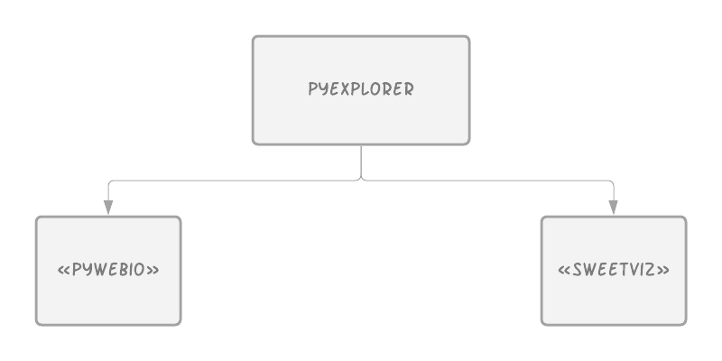

# <p align="middle">_`PyExplorer`_</p>
 _<p align="middle">Данный проект позволяет быстро и эффективно получить основные статистические данные для заданного `.csv` файла</p>_

### Как это работает?
<p align="center">
    
</p>

### Техологический стэк
<p align="center">
    
</p>
Данный проект основан на двух проектах: 

 - «<a href="">pywebio</a>» для визуальной составляющей
 - «<a href="">sweetviz</a>» для анализа загруженного файла.

### Установка
```bash
git clone ...
```

### Запуск
1. Перейдите в директорию со скачанным проектом папкой: `cd /path/to/your/project`
2. Запустите `pip install -r requirements.txt`
3. Запустите `python ./app.py`
```
